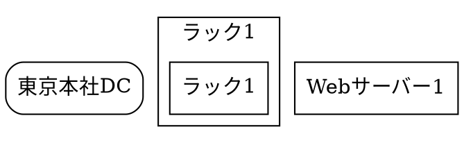

# タブ0: 全体俯瞰UI 実装計画

## 概要

タブ0は、タブ1-4で管理されている階層的なネットワーク情報を統合して表示し、クリックで階層的にドリルダウンできる全体俯瞰UIを提供します。

## 目標

- **全体像の把握**: すべての棟、ラック、機器を一つのビューで確認
- **階層的ナビゲーション**: クリックで階層的に詳細を表示
- **各タブへの連携**: 詳細表示時に該当するタブ（1-4）に自動遷移

## 階層構造

```
タブ0: 全体俯瞰
  ├─ 棟（タブ1のデータ）
  │   ├─ クリック → タブ2の棟内機器構成を表示
  │   │   ├─ ラック（タブ2のデータ）
  │   │   │   ├─ クリック → タブ3のラック内サーバーを表示
  │   │   │   │   ├─ サーバー（タブ3のデータ）
  │   │   │   │   │   └─ クリック → タブ4のサーバー詳細を表示
  │   │   │   │   └─ スイッチ/ルーター（タブ2のデータ）
  │   │   │   │       └─ クリック → タブ2の機器詳細を表示
```

## 実装手順

### フェーズ1: データ統合と取得

#### 1.1 データ取得APIの作成
- **目的**: 各タブのデータを統合して取得
- **実装内容**:
  - `getAllSiteTopologies()`: タブ1の全棟間ネットワークを取得
  - `getSiteEquipmentBySiteId(siteId)`: タブ2の棟内機器構成を取得
  - `getRackServersByRackId(rackId)`: タブ3のラック内サーバーを取得
  - `getServerDetailsByServerId(serverId)`: タブ4のサーバー詳細を取得
  - `getHierarchicalData()`: 全階層のデータを統合して取得

#### 1.2 データ構造の定義
```typescript
interface HierarchicalData {
  sites: SiteNode[];  // タブ1のデータ
}

interface SiteNode {
  id: string;
  label: string;
  // タブ1のデータ
  location?: Location;
  capacity?: Capacity;
  connections?: Connection[];
  // 子ノード（タブ2のデータ）
  racks?: RackNode[];
}

interface RackNode {
  id: string;
  label: string;
  // タブ2のデータ
  location?: RackLocation;
  capacity?: RackCapacity;
  // 子ノード（タブ2の機器 + タブ3のサーバー）
  equipment?: EquipmentNode[];
}

interface EquipmentNode {
  id: string;
  label: string;
  type: 'server' | 'switch' | 'router' | 'firewall' | 'storage';
  // タブ2のデータ
  model?: string;
  position?: Position;
  ports?: Port[];
  // 子ノード（タブ3のサーバー詳細、またはタブ4のサーバー詳細）
  serverDetails?: ServerDetailsNode;
}

interface ServerDetailsNode {
  id: string;
  label: string;
  // タブ3のデータ
  specs?: ServerSpecs;
  ports?: DetailedPort[];
  // 子ノード（タブ4のデータ）
  applications?: ApplicationNode[];
  sequences?: SequenceNode[];
}
```

### フェーズ2: Graphviz DOT生成

#### 2.1 階層的DOT生成関数の作成
- **目的**: 階層的なデータ構造をGraphviz DOT形式に変換
- **実装内容**:
  - `generateHierarchicalDot(data: HierarchicalData, level: 'all' | 'sites' | 'racks' | 'equipment')`: レベルに応じたDOT生成
  - 各ノードにクリック可能な属性を付与
  - 階層を視覚的に表現（クラスター、色分け等）

#### 2.2 DOT属性の設計


### フェーズ3: UIコンポーネント

#### 3.1 タブ0のメインコンポーネント
- **ファイル**: `app/graphviz/components/Tab0/index.tsx`
- **機能**:
  - 階層データの取得と表示
  - Graphvizビューアの統合
  - クリックイベントの処理
  - 階層レベル切り替えUI

#### 3.2 階層レベル切り替えUI
```typescript
interface LevelSelectorProps {
  currentLevel: 'all' | 'sites' | 'racks' | 'equipment';
  onLevelChange: (level: 'all' | 'sites' | 'racks' | 'equipment') => void;
}
```

#### 3.3 ナビゲーションバー
- **機能**:
  - 現在の階層レベル表示
  - 上位階層への戻るボタン
  - 全体表示への戻るボタン

### フェーズ4: クリックイベント処理

#### 4.1 ノードクリックハンドラー
```typescript
const handleNodeClick = (nodeId: string, nodeType: 'site' | 'rack' | 'equipment' | 'server') => {
  switch (nodeType) {
    case 'site':
      // タブ2のデータを取得して表示
      loadSiteEquipment(nodeId);
      setCurrentLevel('racks');
      break;
    case 'rack':
      // タブ3のデータを取得して表示
      loadRackServers(nodeId);
      setCurrentLevel('equipment');
      break;
    case 'equipment':
      if (equipment.type === 'server') {
        // タブ4のデータを取得して表示
        loadServerDetails(nodeId);
        setCurrentLevel('server-details');
      } else {
        // タブ2の機器詳細を表示
        showEquipmentDetails(nodeId);
      }
      break;
    case 'server':
      // タブ4のデータを取得して表示
      loadServerDetails(nodeId);
      setCurrentLevel('server-details');
      break;
  }
};
```

#### 4.2 タブ間の連携
- **実装内容**:
  - クリック時に該当するタブ（1-4）に自動遷移
  - 該当タブで該当データを自動的に読み込み
  - URLパラメータで状態を管理（`?tab=tab2&siteId=site_tokyo`等）

### フェーズ5: 状態管理

#### 5.1 階層状態の管理
```typescript
interface HierarchyState {
  currentLevel: 'all' | 'sites' | 'racks' | 'equipment' | 'server-details';
  selectedSiteId?: string;
  selectedRackId?: string;
  selectedEquipmentId?: string;
  selectedServerId?: string;
  breadcrumbs: BreadcrumbItem[];
}
```

#### 5.2 ブレッドクラム
- **機能**: 現在の階層位置を表示
- **例**: `全体 > 東京本社DC > ラック1 > Webサーバー1`

### フェーズ6: パフォーマンス最適化

#### 6.1 データの遅延読み込み
- **実装内容**:
  - 初期表示は棟レベルまで
  - クリック時に子ノードのデータを取得
  - キャッシュ機能の実装

#### 6.2 Graphvizレンダリングの最適化
- **実装内容**:
  - 大量ノード時の簡略化表示
  - ズーム・パン機能の強化
  - レンダリングの非同期処理

## 技術的な考慮事項

### Graphvizでのクリックイベント

GraphvizのSVG出力では、直接JavaScriptイベントをバインドできないため、以下の方法を検討：

1. **SVG要素へのイベントリスナー追加**
   ```typescript
   useEffect(() => {
     const svgElement = document.querySelector('#graphviz-svg');
     if (svgElement) {
       svgElement.addEventListener('click', handleSvgClick);
       return () => {
         svgElement.removeEventListener('click', handleSvgClick);
       };
     }
   }, [dotCode]);
   ```

2. **DOTのURL属性を利用**
   - Graphvizの`URL`属性を使用してクリック可能なリンクを作成
   - カスタムプロトコル（`graphviz://nodeId`）を使用

3. **SVG要素の直接操作**
   - レンダリング後のSVG要素に直接イベントリスナーを追加
   - ノードIDとDOM要素のマッピング

### データの整合性

- **参照整合性チェック**: 各階層のID参照が正しいか検証
- **データ不整合時の処理**: 参照先が存在しない場合のエラーハンドリング
- **データ更新の反映**: 各タブでデータ更新時にタブ0の表示も更新

## UI/UX設計

### ビジュアル階層

1. **棟レベル**: 大きなボックス、青系の色
2. **ラックレベル**: 中サイズのボックス、緑系の色、クラスター表示
3. **機器レベル**: 小サイズのボックス、黄系の色
4. **サーバー詳細**: 詳細情報をモーダルまたはサイドパネルで表示

### インタラクション

- **ホバー**: ノードにマウスオーバーで詳細情報をツールチップ表示
- **クリック**: ノードクリックで階層を下る
- **ダブルクリック**: 該当タブ（1-4）に直接遷移
- **右クリック**: コンテキストメニュー（詳細表示、編集等）

### ナビゲーション

- **戻るボタン**: 上位階層に戻る
- **全体表示ボタン**: 最上位階層に戻る
- **ブレッドクラム**: 現在位置の表示とクリックで階層移動

## 実装の優先順位

### フェーズ1（必須）
1. データ取得APIの作成
2. 基本的なGraphviz DOT生成
3. タブ0の基本UI

### フェーズ2（重要）
1. クリックイベント処理
2. 階層レベル切り替え
3. タブ間の連携

### フェーズ3（改善）
1. ブレッドクラム
2. パフォーマンス最適化
3. 詳細なインタラクション

## ファイル構成

```
app/graphviz/components/Tab0/
  ├─ index.tsx                    # メインコンポーネント
  ├─ HierarchyViewer.tsx          # 階層ビューア
  ├─ NodeClickHandler.ts          # クリックイベント処理
  ├─ HierarchyDataLoader.ts       # データ取得ロジック
  ├─ generateHierarchicalDot.ts   # DOT生成ロジック
  ├─ Breadcrumb.tsx               # ブレッドクラムコンポーネント
  ├─ LevelSelector.tsx            # 階層レベル選択UI
  └─ types.ts                     # 型定義
```

## 次のステップ

1. **データ取得APIの実装**: 各タブのデータを統合して取得するAPIを作成
2. **基本的なDOT生成**: 階層的なDOT生成ロジックの実装
3. **タブ0の基本UI**: シンプルな全体表示UIの作成
4. **クリックイベント**: 基本的なクリックイベント処理の実装
5. **段階的な機能追加**: 上記の優先順位に従って機能を追加

